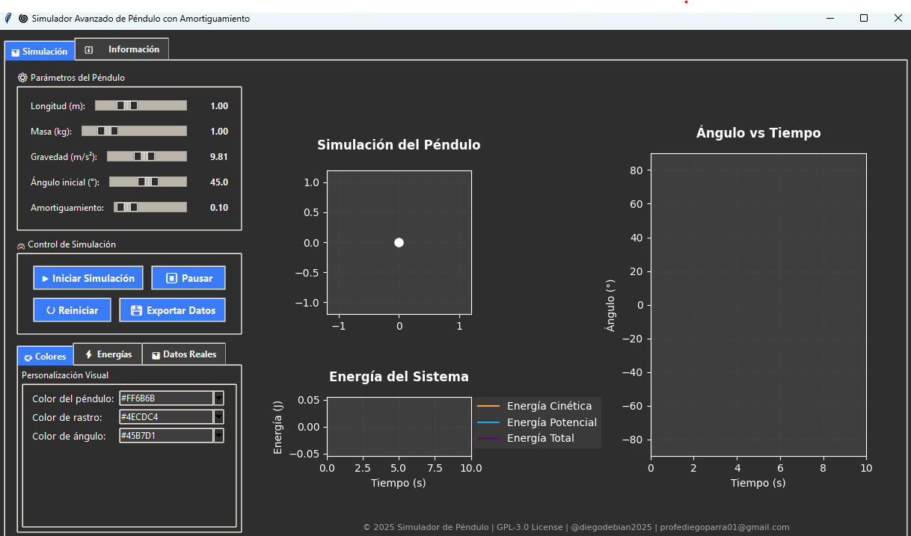
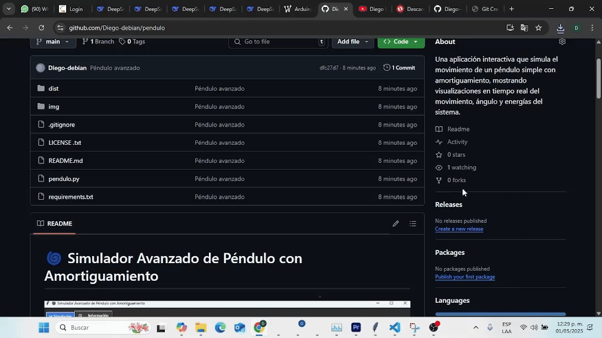
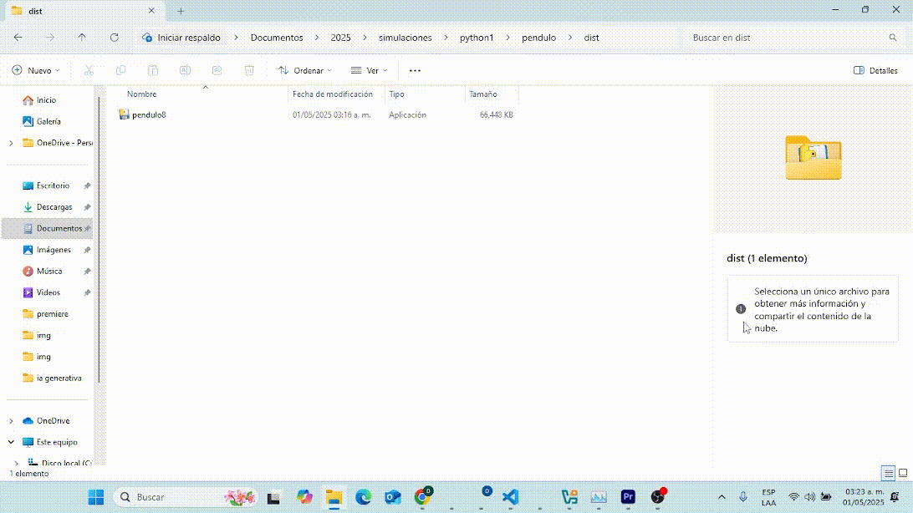

# 🌀 Simulador Avanzado de Péndulo con Amortiguamiento



Una aplicación interactiva que simula el movimiento de un péndulo simple con amortiguamiento, mostrando visualizaciones en tiempo real del movimiento, ángulo y energías del sistema.

## Características Principales

- **Simulación física precisa** del péndulo con amortiguamiento
- **Visualización en tiempo real** del movimiento pendular
- **Gráficos integrados** de ángulo vs tiempo y energías del sistema
- **Ajuste interactivo** de parámetros físicos (longitud, masa, gravedad, etc.)
- **Personalización completa** de colores para todos los elementos visuales
- **Datos en tiempo real** de posición, velocidad y energías
- **Exportación de datos** para análisis posterior

## 📥 Instalación
Puedes entrar a la carpeta dis y descargar directamente el ejecutable pendulo 
 

o puedes compilarlo tu mismo de la siguiente manera
1. Clona el repositorio:
   ```bash
   git clone https://github.com/Diego-debian/pendulo.git
   cd dist
Ahora solo abre el archivo pendulo y listo.
### Opcional
* Instala las dependencias
   ```bash 
   pip install numpy matplotlib scipy pillow

* . Ejecuta la aplicación
   ```bash 
   python pendulo.py

## 🛠️ Uso
   1. Ajusta los parámetros del péndulo usando los controles deslizantes

   2. Presiona "▶ Iniciar Simulación" para comenzar la animación

   3. Usa "⏸ Pausar" y "↻ Reiniciar" según necesites

   4. Personaliza los colores en la pestaña de configuración

   5. Explora los datos en tiempo real en la pestaña "📊 Datos Reales"

   6. Exporta los datos para análisis externo si lo deseas

## 📊 Visualizaciones
   La aplicación muestra tres gráficos principales:

   Simulación del Péndulo: Representación visual del movimiento pendular

   Ángulo vs Tiempo: Gráfico del ángulo en función del tiempo

   Energías del Sistema: Evolución de las energías cinética, potencial y total

   

## 📝 Pestaña de Información
   Incluye documentación completa sobre:

   Descripción del proyecto

   Instrucciones de uso detalladas

   Créditos y licencia

   Información de contacto

## 🧮 Física Implementada
   El simulador resuelve las ecuaciones diferenciales del   péndulo amortiguado:
   $$
   d²θ/dt² + (b/m)·dθ/dt + (g/L)·sin(θ) = 0
   $$
   Donde:

   θ: Ángulo del péndulo

   b: Coeficiente de amortiguamiento

   m: Masa del péndulo

   g: Aceleración gravitatoria

   L: Longitud del péndulo

## 📜 Licencia
Este proyecto está licenciado bajo la Licencia GPL-3.0 - ver el archivo LICENSE para más detalles.

✉️ Contacto
Diego Parra - @diegodebian2025 - profediegoparra01@gmail.com

Enlace del proyecto: https://github.com/Diego-debian/pendulo.git

youtube: https://www.youtube.com/@dapg5847

TikTok: https://vt.tiktok.com/ZShL1p4p9/